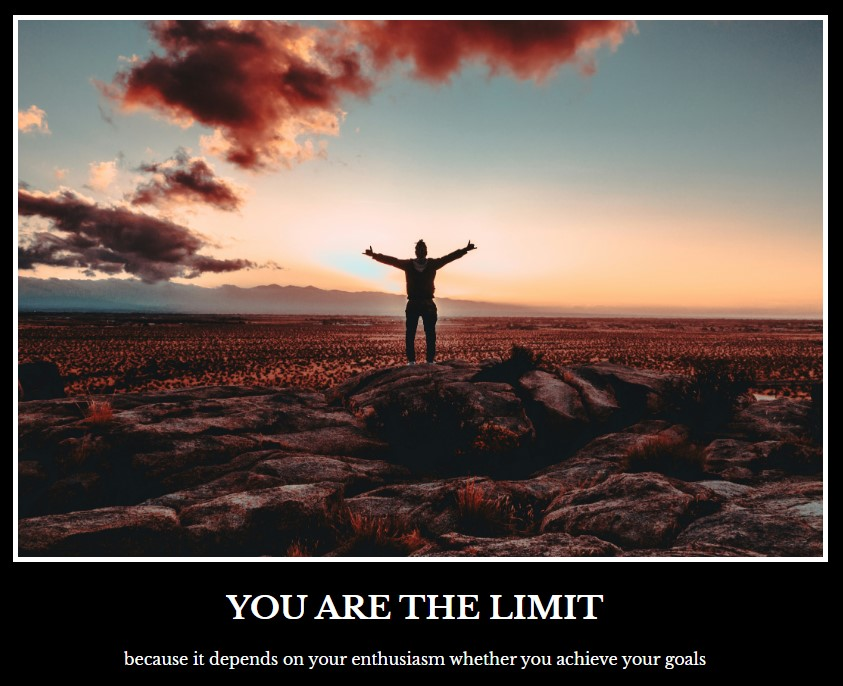

# Web Development Bootcamp - Project_MotivationMeme

Final Project of Properties CSS.

## Table of contents

- [Overview](#overview)
  - [Screenshot](#screenshot)
  - [Links](#links)
- [My process](#my-process)
  - [Built with](#built-with)
  - [Useful resources](#useful-resources)

## Overview

### Screenshot

### Links

- Live Site URL: https://mateusz-przybyla.github.io/HTML-CSS-Project_MotivationMeme/

## My process

### Built with

- CSS colors (RGB, hex codes)
- Font properties (font size, weight)
- The CSS Box Model (margin, padding, border)

### Useful resources

- [Web Development Bootcamp](https://www.udemy.com/course/the-complete-web-development-bootcamp/?couponCode=KEEPLEARNING) - The Web Development Bootcamp in which I am taking part.
- [MDN Web Docs](https://developer.mozilla.org/en-US/) - My best website which help me understand rules and features about HTML and CSS languages.
- [RGB Mixer](https://www.csfieldguide.org.nz/en/interactives/rgb-mixer/)
